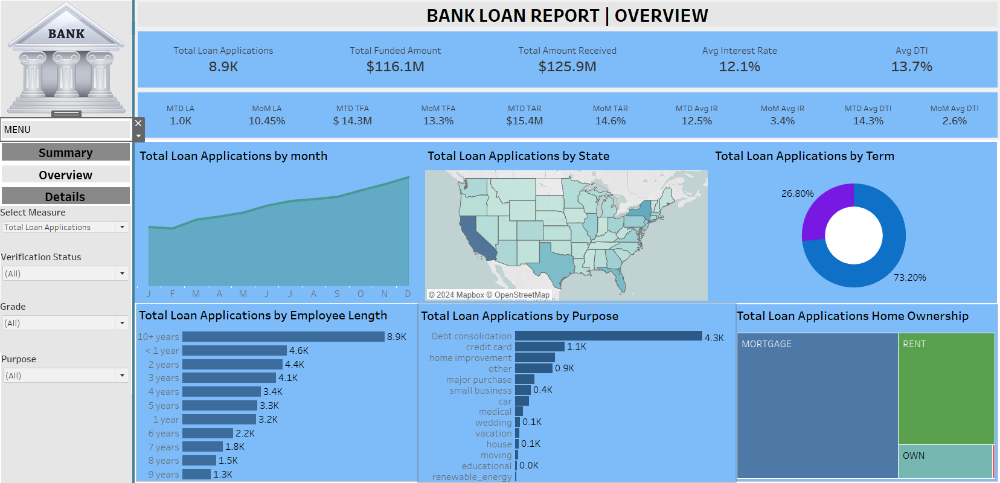

# Bank Loan Report Dashboard

## Overview
The project's goal is to collect the data from the bank database, clean the data, explore the required data with respect to company requirements, and then analyze the good loans, bad loans, bank amount funded, bank profit, bank loss, etc and create a dashboard using Tableau wrt KPIs.
## Project Structure & Task

1. Collect the necessary details about the Bank loan analysis report by the client.

2. (Explore Process) Fletch the data from the client Database to "MS SQL Server".

3. (Transform Process) Analyze, Clean, and extract the required data according to "Key Performance Indicators (KPIs)".

4. Deal with the null, missing, and error data to project requirements using "MS SQL Server or Excel".

5. (Load Process) Load the clean and transform data into a "Tableau".

6. Create a Dashboard according to the requirement in "Tableau".

## Data & Resource Used

**Dataset**

Option 1: [Kaggle](https://www.kaggle.com/datasets?fileType=csv)

Option 2: And, also the dataset can be found on [Data Tutorials](https://www.youtube.com/@datatutorials1) YouTube Channel. I am grateful for his guidance on this project.

**Tools** 

Microsoft Excel,MS SQL Server and Tableau.
## Data Analysis & Visualization 
### 1. Exploratory Analysis using MS SQL Server

**Insight:** Overview Requirements of the KPI's

### 2. Summary Dashboard

**Insight:** In the summary dashboard, you can click on filters for Purpose, Grade, and Verification Status to explore bank loan data for the year 2021. This includes Total Loan Applications, Total Funded Amount, Total Amount Received, Average Interest Rate, Average Debt-to-Income Ratio (DTI), along with their monthly averages and monthly growth rates. Additionally, information on Good Loan Issued, Bad Loan Issued, and Loan Status is available.

### 3. Overview Dashboard

**Insight:** In the overview dashboard, you can also click on filters for Purpose, Grade, and Verification Status to explore bank loan data for the year 2021. Additionally, you can explore a summary of monthly data, bank loan details for each state in the U.S., loan terms, borrower's years of employment, loan purposes, and the homeowner status of the borrower. When clicking on these diagrams, the data will interactively change across all diagrams and tables.

### 4. Details Dashboard

**Insight:** In the details dashboard, you can also click on filters for Purpose, Grade, and Verification Status to explore bank loan data for the year 2021. In addition, you can click on the main table's headers to sort and filter, and you can scroll through the main table to view all the loan data records for the banks in 2021.

## Conclusion
The project successfully achieved its goal of collecting, cleaning, and analyzing data from the bank's database. The analysis focused on key financial metrics such as good loans, bad loans, bank amount funded, profit, and loss. By leveraging Tableau, an interactive dashboard was created to present these key performance indicators (KPIs) in a visually compelling manner. This dashboard provides a clear overview of the bank's lending activities, enabling stakeholders to quickly assess financial health and operational performance. The insights gained from the analysis are crucial for understanding the distribution and quality of loans, as well as the bank's overall profitability and risk exposure.
## Recommendations
**Enhanced Risk Assessment Models:** Develop more sophisticated risk assessment models that incorporate additional variables such as economic indicators, borrower credit scores, and market conditions to improve the accuracy of predicting bad loans.

**Trend Analysis:** Incorporate historical data to perform trend analysis, helping the bank to identify patterns over time in loan performance, funding amounts, and profit/loss metrics.

**Segment Analysis:** Conduct a deeper analysis of loans segmented by different criteria, such as loan type, customer demographics, and geographical location, to identify specific areas of strength and potential risk.

**Predictive Analytics:** Implement predictive analytics to forecast future loan performance and financial outcomes, aiding in strategic planning and resource allocation.

**Integration of Real-Time Data:** Enhance the dashboard with real-time data integration to provide up-to-date insights, allowing the bank to respond swiftly to emerging risks and opportunities.

## Reflection
This project underscored the importance of a structured approach to data management and analysis. The process of data cleaning and preparation was critical to ensuring the accuracy and reliability of the subsequent analysis. The use of Tableau as a visualization tool demonstrated the power of interactive dashboards in making complex data accessible and actionable for stakeholders. The project also highlighted the potential for advanced analytics to drive strategic decision-making in the banking sector. Moving forward, a focus on expanding analytical capabilities and integrating more sophisticated predictive and risk assessment tools will be essential for maintaining a competitive edge and optimizing financial performance.

